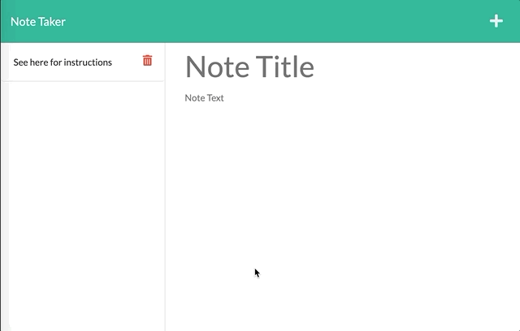

# Note Taker

## Description
This is a note taker built with Node.js, Express, and is deployed on Heroku [here](https://mysterious-oasis-91030.herokuapp.com/). This lets you write notes, save notes, view previous notes, and delete previous notes. This also uses the [uniqid](https://www.npmjs.com/package/uniqid) npm package.

Functionality shown below

## Table of Contents 
* [Installation](#installation)
* [Usage](#usage)
* [License](#license)
* [Contributing](#contributing)
* [Tests](#tests)
* [Questions](#questions)

## Installation
Run the following code to install dependencies:

        npm i

## Usage
See deployed app [HERE](https://mysterious-oasis-91030.herokuapp.com/)
1. Click "Get started" to see all the saved notes
2. Click + to create a new note
3. Once you type in a title and text, click the save icon to save
4. The note will be saved to the lefthand side
5. Click on any of the previous notes to see the content
6. Click delete to delete a previous note

## License
This project uses MIT license.

## Contributing
I'd love ideas on how to improve this. Email rpgarde@gmail.com if you want to contribute anything!

## Tests
No tests installed on this repo. 

## Questions
For any further questions, reach out to rpgarde@gmail.com or visit my [Github profile](https://github.com/rpgarde).